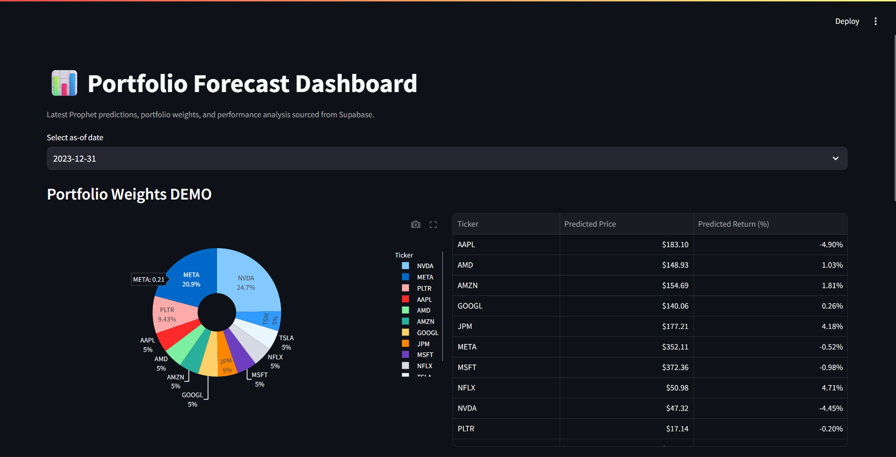

# Prophet Forecasting for Portfolio Optimisation
## 📊 Portfolio Optimisation Result

Below is the result generated by the Prophet-based forecasting and portfolio optimisation model:




## Hello Interns! Welcome to This Educational Project

This project is built by **techiehelp** and is **only for educational purposes**. It's designed to help you learn how to build a real-world machine learning project step by step. We'll create a system that predicts stock prices and suggests the best way to invest in a portfolio.

**Important Note:** This is not real financial advice. It's just for learning!

## What is This Project?

Imagine you have some money to invest in stocks like Apple, Google, or Tesla. This project helps you:
1. Predict what the stock prices might be tomorrow using past data.
2. Suggest how much money to put in each stock to get the best balance of risk and reward.

It's like a smart assistant for your investments, but again, this is just for learning!

## What You'll Learn by Building This

- How to use Python for data science and machine learning
- How to get stock data from the internet
- How to build prediction models (using a tool called Prophet)
- How to solve math problems to optimize investments (Markowitz theory)
- How to create a simple web app to show your results
- How to set up and run a project on a server

## Step-by-Step Guide to Build This Project

### Step 1: Get Your Computer Ready (Prerequisites)

Before we start, you need a few things installed on your computer. Don't worry, we'll explain each one!

1. **Python 3.12 or newer**
   - Python is the programming language we'll use.
   - Download from: https://www.python.org/downloads/
   - Install it and make sure it's working by opening a terminal and typing `python --version`

2. **Poetry**
   - This helps manage our project and install libraries.
   - Install with: `pip install poetry`
   - Check with: `poetry --version`

3. **Git**
   - For downloading code from GitHub.
   - Download from: https://git-scm.com/downloads

That's it for basics! The other tools (like Supabase for database) are optional for learning.

### Step 2: Download the Project

1. Open your terminal (Command Prompt on Windows, Terminal on Mac/Linux)
2. Go to a folder where you want to save the project: `cd Desktop`
3. Download the code: `git clone [repository URL]` (ask your mentor for the URL)
4. Go into the project folder: `cd Prophet-Forecasting-For-Portfolio-Optimisation-main`

### Step 3: Set Up the Database (Optional)

If you want to save results to a database, follow these steps:

1. **Create a Supabase Account** (Free)
   - Go to https://supabase.com
   - Sign up for a free account
   - Create a new project

2. **Set Up the Database Table**
   - In your Supabase project, go to the SQL Editor
   - Open the `schema.sql` file from this project
   - Copy all the SQL code and paste it into the SQL Editor
   - Click "Run" to create the table

3. **Get Your Credentials**
   - In Supabase, go to Settings > API
   - Copy your Project URL and anon/public key
   - Create a `.env` file in the project root (or edit the existing one)
   - Add these lines (replace with your actual values):
     ```
     SUPABASE_URL=https://your-project.supabase.co
     SUPABASE_KEY=your-anon-key-here
     ```

**Note:** If you skip this step, the app will still run and show predictions, but won't save them to a database.

### Step 4: Install the Project

1. In the terminal, inside the project folder, run: `poetry install`
   - This will download all the libraries we need (like Prophet for predictions, pandas for data, etc.)
   - It might take a few minutes.

2. If you see any errors, ask your mentor for help.

### Step 5: Understand the Project Structure

Look at the files in the project:
- `src/main.py` - The main code that runs everything
- `src/settings.py` - Settings like which stocks to use
- `src/extractor.py` - Code to get stock data
- `src/model.py` - The prediction model
- `src/optimiser.py` - The investment optimization
- `src/streamlit_app.py` - The web app to show results
- `src/database.py` - Code to save results to Supabase
- `schema.sql` - Database table definition for Supabase

### Step 6: Run Your First Prediction

1. In the terminal, run: `poetry run python -m src.main`
   - This will download stock data, make predictions, and suggest investments.
   - You'll see output like predicted prices and optimal weights.

2. Try changing stocks in `src/settings.py`:
   - Open the file and change `PORTFOLIO_TICKERS` to different stocks like `["MSFT", "GOOGL"]`
   - Run again to see different results!

### Step 7: Create a Simple Web Dashboard

1. Run: `poetry run streamlit run src/streamlit_app.py`
   - This starts a web app at http://localhost:8501
   - Open your browser and go there to see charts and predictions.

2. Explore the dashboard - it shows your portfolio suggestions visually.

### Step 8: Learn by Modifying the Code

Try these experiments:
- Change the date range in `settings.py` to see how predictions change
- Add more stocks to the portfolio
- Look at `src/model.py` to understand how predictions work
- Modify `src/optimiser.py` to change how investments are balanced

### Step 9: Deploy to a Server (Advanced)

If you want to share your project online:
1. Get a free account on Hostinger or similar
2. Follow the deployment guide in the links below
3. Your app will run automatically every day!

## How Does It Work? (Simple Explanation)

1. **Get Data**: We download historical stock prices from Yahoo Finance.

2. **Make Predictions**: Using Prophet (a Facebook tool), we predict tomorrow's prices based on past patterns.

3. **Optimize Portfolio**: We use math to figure out the best mix of stocks - some give high returns but are risky, others are safer.

4. **Show Results**: We save the results and show them in a nice web app.

## Links for More Learning

- **Presentation Slides**: [Here](https://gamma.app/docs/Prophet-Forecasting-for-Portfolio-Optimisation-7qsgynwy1h5x3it)
- **Python Basics**: Search for "Python for beginners"
- **Prophet Tutorial**: https://facebook.github.io/prophet/docs/quick_start.html
- **Streamlit Guide**: https://docs.streamlit.io/

## Need Help?

Ask your mentor or check the code comments. Remember, this is for learning - have fun experimenting!

**Built by techiehelp for educational purposes only.**

